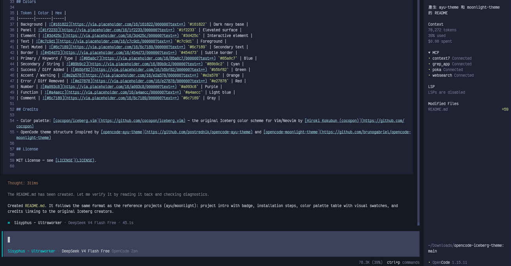

# Iceberg Theme for OpenCode

A dark blue theme for [OpenCode](https://opencode.ai) based on the elegant [Iceberg](https://github.com/cocopon/iceberg.vim) color scheme by [cocopon](https://github.com/cocopon). Designed for a calm, cool-headed coding experience.



## Installation

1. Create the themes directory (if it doesn't exist):
   ```bash
   mkdir -p ~/.config/opencode/themes
   ```

2. Download the theme file:
   ```bash
   curl -o ~/.config/opencode/themes/iceberg.json \
     https://raw.githubusercontent.com/cccheng/opencode-iceberg-theme/main/.opencode/themes/iceberg.json
   ```

3. Add the theme to `~/.config/opencode/opencode.json`:
   ```json
   {
     "theme": "iceberg"
   }
   ```

4. Restart OpenCode.

**Alternatively**, inside OpenCode type `/themes` and select `iceberg`.

## Colors

| Token | Color | Hex |
|-------|-------|-----|
| Background | `#161822` | Dark navy base |
| Panel | `#1f2233` | Elevated surface |
| Element | `#3d425c` | Interactive element |
| Text | `#c7c9d1` | Foreground |
| Text Muted | `#6c7189` | Secondary text |
| Border | `#454d73` | Subtle border |
| Primary / Keyword / Type | `#85a0c7` | Blue |
| Secondary / String | `#89b9c2` | Cyan |
| Success / Diff Added | `#b5bf82` | Green |
| Accent / Warning | `#e2a578` | Orange |
| Error / Diff Removed | `#e27878` | Red |
| Number | `#a093c8` | Purple |
| Function | `#a4aecc` | Light blue |
| Comment | `#6c7189` | Gray |

## Credits

- Color palette: [cocopon/iceberg.vim](https://github.com/cocopon/iceberg.vim) — the original Iceberg color scheme for Vim/Neovim by [Hiroki Kokubun (cocopon)](https://github.com/cocopon)
- OpenCode theme structure inspired by [opencode-ayu-theme](https://github.com/postrednik/opencode-ayu-theme) and [opencode-moonlight-theme](https://github.com/brunogabriel/opencode-moonlight-theme)

## License

MIT License — see [LICENSE](LICENSE).
